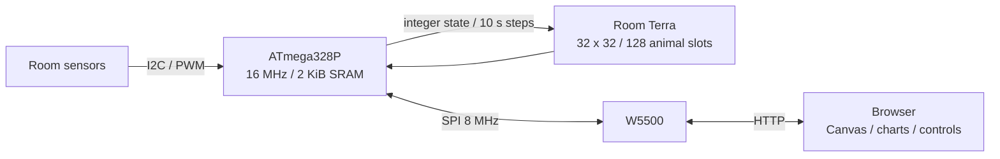
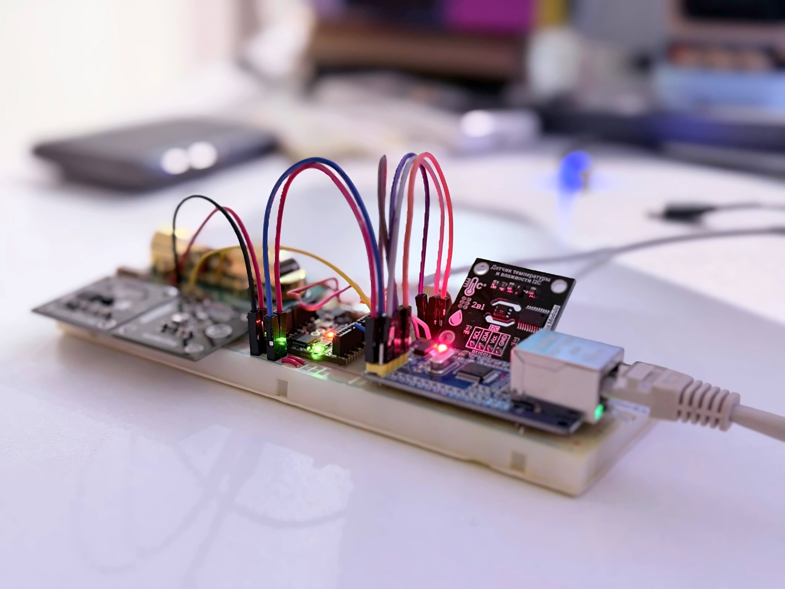

# AIR / 328

A real HTTP server, live room instruments, and a shared ecosystem on an
**Arduino UNO Mini Limited Edition**. The ATmega328P runs the simulation,
reads the sensors and serves the website from its own Flash. The browser
draws the interface; W5500 handles Ethernet and TCP.

[Live project](http://corvax.uk:8080/) · [Room Terra](http://corvax.uk:8080/terra) ·
[Day / night](docs/DAY-NIGHT.md) · [Model](docs/TERRA.md) В· [Air response](docs/TERRA-AIR.md) В· [Build](#build)





[Assembly photographs](docs/ILLUSTRATIONS.md) · [Engineering diagrams](docs/ILLUSTRATIONS.md#engineering-diagrams) · [Internet load results](evidence/LOAD.md)

## What fits

- Temperature, humidity, pressure, light and CO2; bounded acquisition and
  explicit missing-data handling.
- A 32 x 32 ecosystem: plants, herbivores, predators, pond, shelters and a
  shared visitor action reserve. Room light controls a gradual terrain tint and debounced night. Temperature,
  humidity and CO2/pressure influence the model.
- Four cooperative HTTP peers sharing **one 512-byte workspace**. Compressed
  HTML/CSS/JS streams from `PROGMEM`; the MCU does not decompress the page.
- **584 bytes** of world state: two bits per plant cell and packed animals.
  A complete browser snapshot is **480 bytes**.
- Integer sensor/model arithmetic; no application heap or Serial logging.
- I2C recovery, W5500 recovery and an 8-second watchdog.
- A view counter with a 128-record CRC EEPROM ring and 15-minute checkpoints.
  It counts page loads, not unique people. Worlds restart after power loss.

### Resource measurements

| Build | Application Flash / 32,256 B | Static SRAM / 2,048 B | Embedded gzip |
|---|---:|---:|---:|
| Deployed 0.12.9-terra reference | 32,250 B | 1,492 B | 11,385 B |
| Public source edition | 31,836 B | 1,492 B | 10,971 B |

The remaining 556 bytes after reference globals must also accommodate the
stack and interrupts. It is not all available for new arrays. A prior
instrumented 128-animal run observed a 413-byte minimum stack gap; this is
a measurement, not a worst-case proof. See [evidence and limits](evidence/README.md).

Build hashes: [public-build.json](evidence/public-build.json).

Production has 6 B of application Flash headroom; this public build has 420 B.

The public edition has example networking, no analytics or search-ownership
tags, and an origin-relative canonical URL. It is **not byte-identical** to
the deployed firmware. Sensor/model algorithms and the 512-byte buffer are
preserved. The build recomputes the resource labels embedded in the website.

## Hardware

Target: `arduino:avr:unomini`, ATmega328P at 16 MHz. This is board-specific
firmware, not a generic ESP32 or UNO R4 project.

| Module signal | UNO Mini pin |
|---|---|
| W5500 SCS / CS | D10 |
| W5500 MOSI / COPI | D11 |
| W5500 MISO / CIPO | D12 |
| W5500 SCLK | D13 |
| I2C sensor SDA | D18/SDA (same MCU signal as A4) |
| I2C sensor SCL | D19/SCL (same MCU signal as A5) |
| MH-Z14A PWM | D5 |
| All grounds | GND |

Installed drivers:

- Trema temperature/humidity **I2C module at 0x20** (module model 5). This
  firmware speaks the module protocol, not a bare Sensirion SHT3x protocol.
  Configure the module address separately; runtime code does not rewrite it.
- Trema light I2C module at **0x09**.
- BMP085/BMP180 at **0x77**, chip ID 0x55.
- MH-Z14A **400–5000 ppm**, PWM; allow its warm-up and specified power supply.

Use regulated power and modules compatible with the UNO's 5 V signals. The
W5500 chip itself uses 3.3 V; a module's marked 5 V input must include the
appropriate regulator. The tested W5500 wiring uses **SPI mode 3 at 8 MHz**.
UNO Mini headers have 1.27 mm pitch. Missing sensors do not prevent HTTP or
the world from running; model fallbacks are described in the model document.

## Build

Pinned tools: Arduino CLI **1.5.1**, Arduino AVR Boards **1.8.8**, Python
**3.12**, Node.js **24**, Terser **5.44.0**, Zopfli **0.4.1**. Exact archives,
checksums and compiler flags: [toolchain-lock.json](toolchain-lock.json).

```sh
git clone https://github.com/Corvaxdev/uno-mini-air.git
cd uno-mini-air
python -m pip install -r requirements-build.txt
npm ci
arduino-cli core update-index
arduino-cli core install arduino:avr@1.8.8
```

Edit [NetworkConfig.h](firmware/UnoMiniEthernet/NetworkConfig.h): choose an
unused address in your LAN, its gateway/netmask, and a unique locally
administered MAC. Defaults are examples: **192.168.1.222:80**. There is no DHCP.

```sh
python tools/rebuild.py --output build-public
```

The output directory must be new or empty. Use `--cli /path/to/arduino-cli`
and `--config /path/to/arduino-cli.yaml` if needed. The script packs assets,
compiles with the three project-local libraries, converges the displayed
memory figures and rejects Flash overflow or static SRAM >= 1,600 bytes.
It never uploads. On a constrained system disk, put dependencies, tool caches
and the output directory on a data drive.

Outputs:

- `build-public/build/UnoMiniEthernet.ino.hex` and `.elf`
- `build-public/source/site.html.gz` and the generated `site_gz.h`
- `build-public/rebuild-result.json` with sizes and SHA-256 hashes

The 1,600-byte limit is a build guard, not a proof of stack safety. Keep the
project-local Wire library: its largest supported transaction is 22 bytes.

After checking the board and port, upload explicitly:

```sh
arduino-cli board list
arduino-cli upload --fqbn arduino:avr:unomini --port YOUR_PORT --input-dir build-public/build
```

Uploading replaces the sketch and resets the in-memory ecosystem. Back up
an existing device first. No upload or hardware access is performed by CI.

## Tests

Linux/macOS with Python and `g++` (or `CXX=clang++`):

```sh
python tests/run.py --output build-host-tests
```

This executes the actual model and HTTP parser under AddressSanitizer and
UndefinedBehaviorSanitizer: model invariants, night hysteresis, sensor
fallbacks, action validation, snapshot bounds, arithmetic extremes, light-dose arithmetic, routes and all 4,096 action encodings. The HTTP response test
extracts the header function from the current sketch. Tests are local and
never send traffic to the live project.

The host runner also supports repeatable population experiments; for example:

```sh
build-host-tests/terra batch 20 25920 230 500 320 600 101325 4 201
```

That is 20 seeds for 72 simulated hours, at 23.0 C, 50.0% RH, 320 lx with a 16 h / 8 h light/dark cycle,
600 ppm and 101325 Pa. Recorded runs and their limitations are in `evidence/`.

## HTTP and boundaries

`/` live instruments · `/terra` ecosystem · `/lab` measurements · `/devlog`
milestones · `/api` sensor JSON · `/life` binary world state.

`PUT /life/XYZ` queues a hexadecimal action: low 10 bits select the cell,
next two bits select planting / herbivore / predator. `202` means queued,
not applied. The MCU revalidates at a world boundary and charges only a
successful action. Everyone shares the reserve and cooldown.

The board speaks **plain HTTP**, without TLS, authentication or per-user
fairness. A normal browser reaches the demo through DNS and router port
forwarding; no Raspberry Pi or application proxy is needed for serving it.
The code is an experiment, not a hardened Internet appliance. The published
load evidence includes an unresolved loss of connectivity under an earlier
10-client test. Please run load tests against your own board.

## License

Original project code is **[MIT](LICENSE)**: use, modify, distribute and sell
it, retaining the license/copyright notice. Copyright belongs to **Corvaxdev**.
Vendored Arduino-derived drivers retain their upstream LGPL/GPL license
choices; see [THIRD_PARTY.md](THIRD_PARTY.md). Arduino names and marks belong
to their respective owners; this is an independent project.
