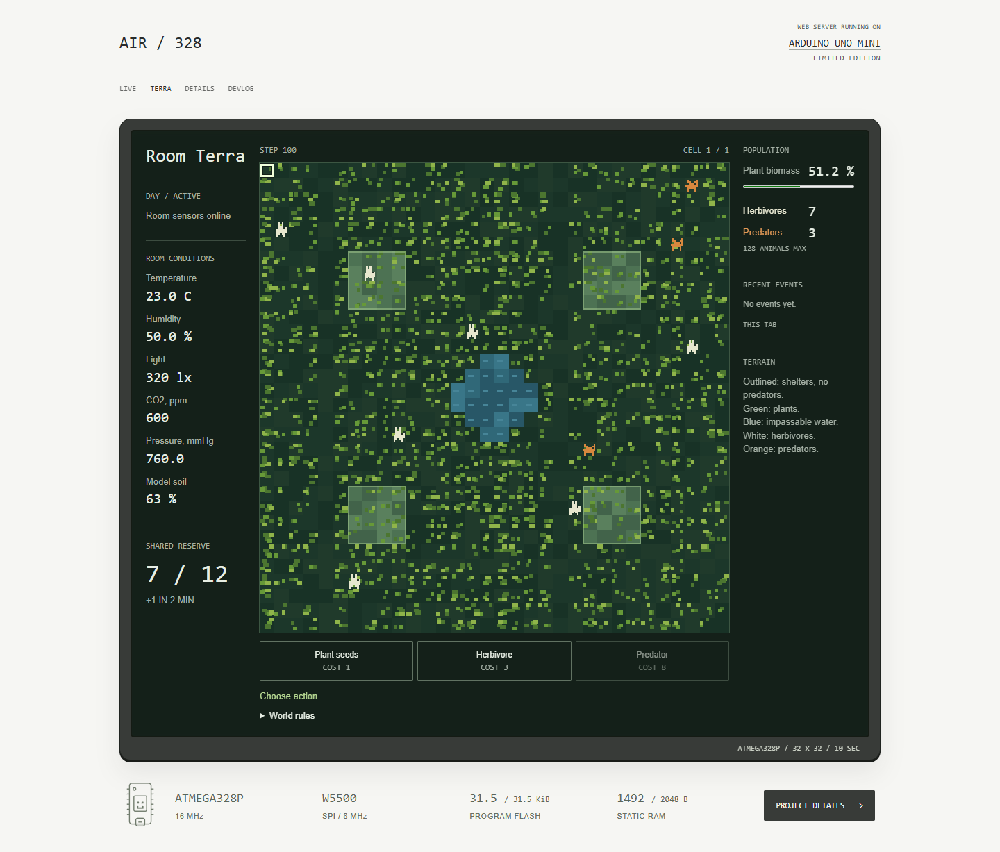
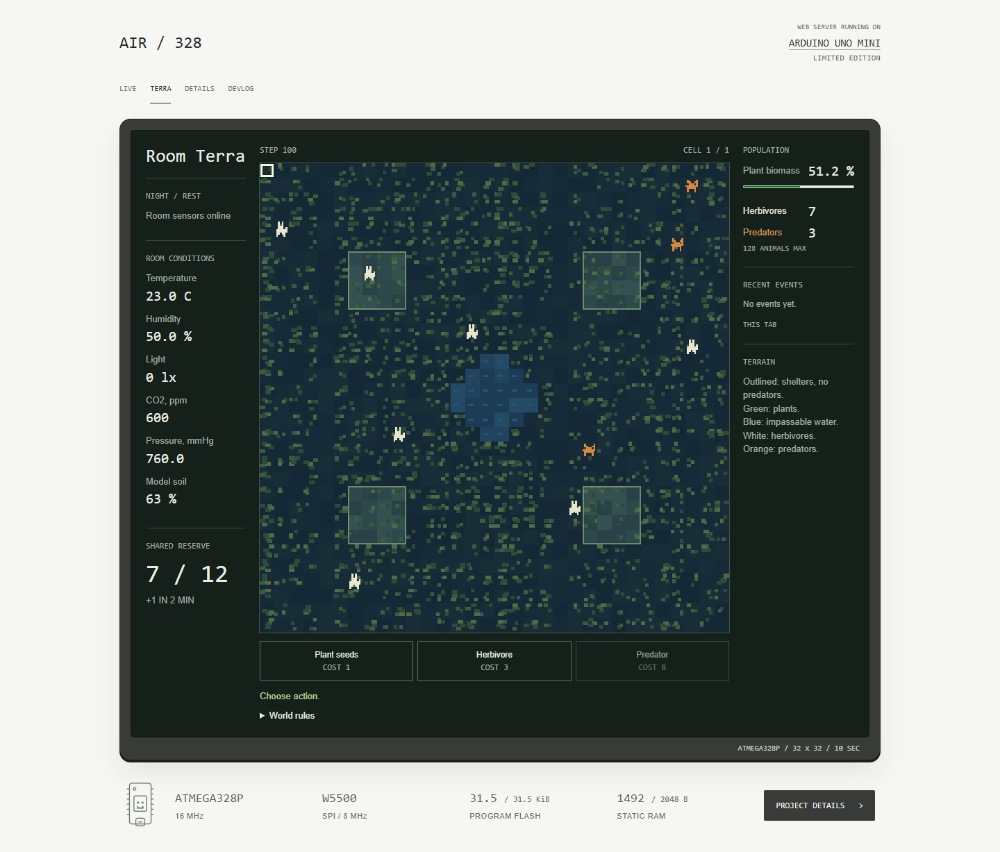

# Room light and map lighting — 0.12.9

Full daylight corresponds to 320 lx in this room. The MCU sends both the raw
lux reading and an 8-bit light level: clamp((lux - 10) * 255 / 310, 0, 255).
The browser shades terrain using that level. Animals, selection and shelter
outlines remain readable. This is independent of the operating system's theme.

Night requires <=25 lx for 18 successive 10-second samples (three minutes).
Day resumes after >=41 lx for the same interval. Values between the thresholds
hold the existing state. NIGHT adds a 50% blue terrain tint. At night biological
passes run once per 32 world steps; sensor reads and 10-second world boundaries continue.

One extra byte accumulates prolonged illumination stress. Every 64 steps,
day adds clamp(floor(lux / 320), 1, 8); night removes three, with saturation.
Above 128, growth is multiplied by (255 - debt) / 128. A 16 h / 8 h room cycle
clears the debt nightly; permanent or extreme light can exhaust the food supply.
There are no scheduled extinction events. These are game coefficients.

Both images use the production 0.12.9 renderer and the same synthetic snapshot.
Only light inputs and the qualified night flag differ. They demonstrate the
appearance, not two physical sensor measurements or measured population outcomes.
