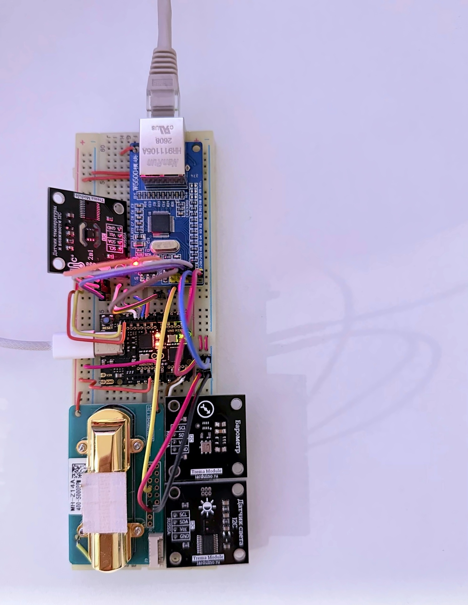
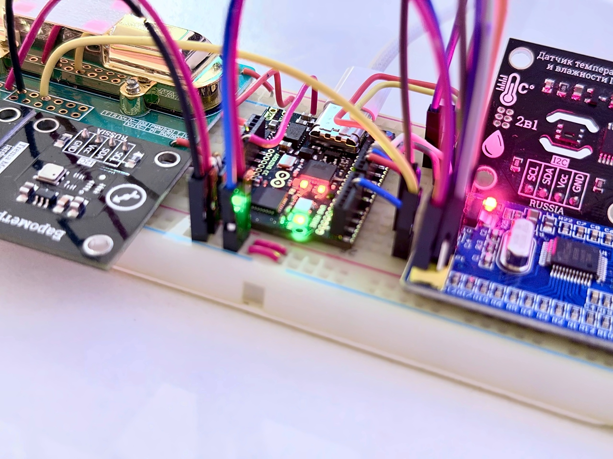
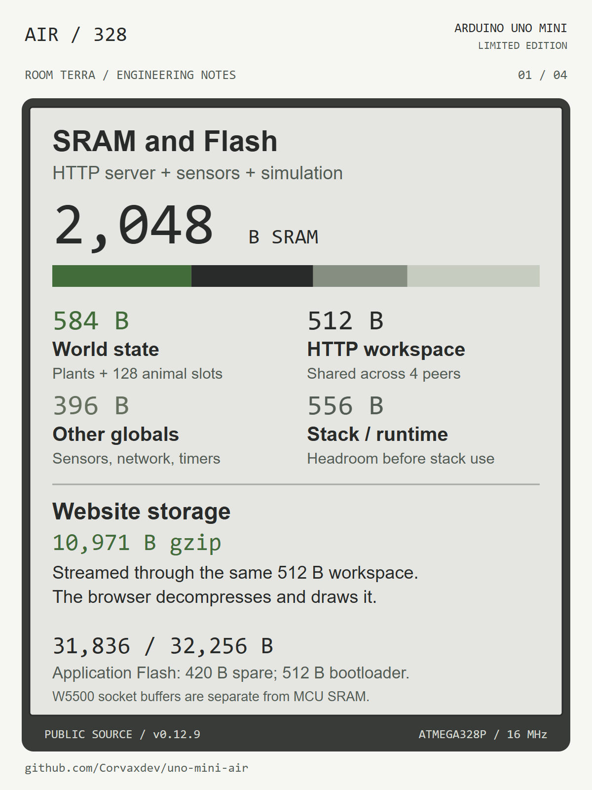
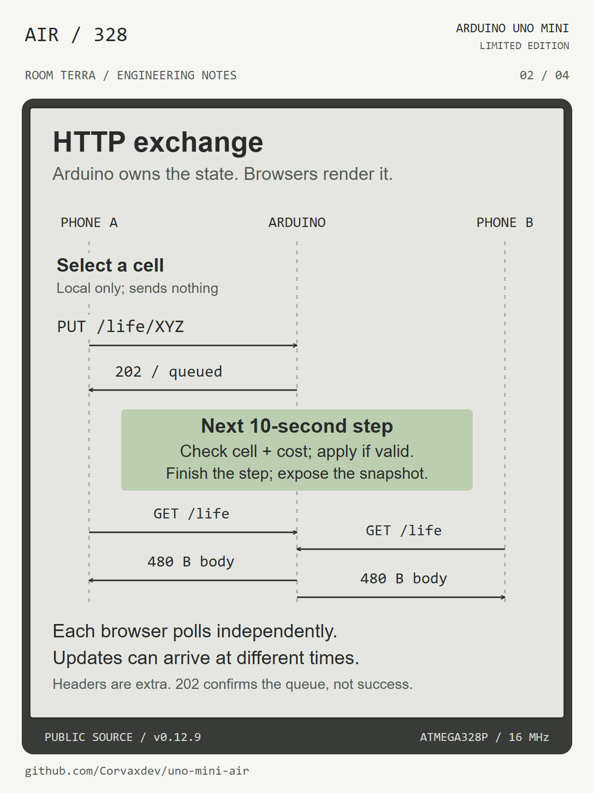
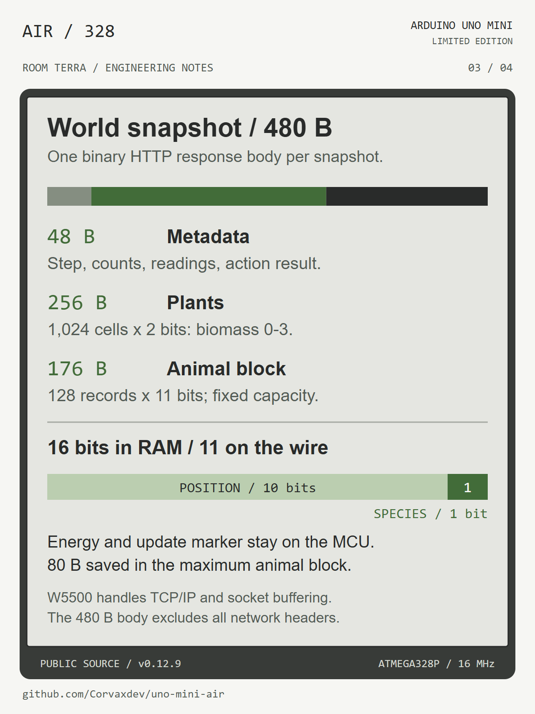
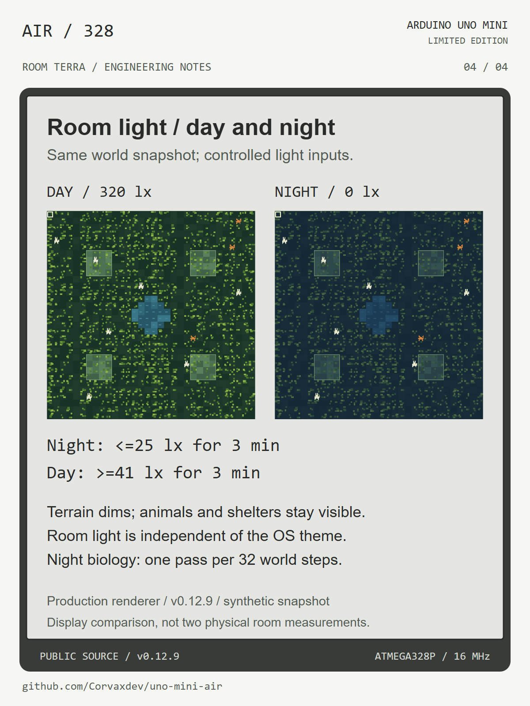

# Assembly and engineering diagrams

Original assembly photographs supplied by Corvaxdev, unchanged. No generated
hardware or composited components. These media files document the current stand.

## Engineering diagrams

The memory figure describes the independently compiled public 0.12.9 source
edition. Production sizes differ; see README. A response body is not a TCP packet.

The lighting images use the production renderer, the same synthetic world and
controlled 320/0 lx inputs. They illustrate the display, not two measured room
states. [Full screenshots and thresholds](DAY-NIGHT.md).

SVG sources accompany the PNG files. Text and arithmetic are explicit,
programmatically checked and visually reviewed; not generated inside a raster image.
